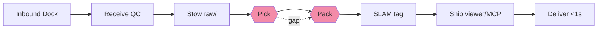

# 0001 — Knowledge Fulfillment Center

## Context

Wany KB hoy funciona como un almacén de conocimiento personal: los scripts de `ingest/` traen fuentes brutas (GitHub trending, HN, arXiv, papers) a `raw/`, y un compilador manual (`kb.sh compile`) las convierte en artículos `wiki/`. El viewer (`viewer/server.js`, ~2500 LOC con CSS inline) sirve la KB localmente.

El pipeline se puede mapear 1:1 al fulfillment de Amazon:

| Amazon       | Wany KB                                                                           |
|--------------|-----------------------------------------------------------------------------------|
| Inbound Dock | Fuentes brutas llegan (GitHub trending, HN, arXiv, papers, proyectos)             |
| Receive      | QC inicial — relevancia, duplicados, ruido (`trending.sh`, `tech-news.sh`)        |
| Stow         | Se guarda en `raw/` con metadata — ubicación registrada en índice                 |
| Pick         | El compilador recibe un pedido ("dame todo sobre agent memory") → busca en `raw/` |
| Pack         | LLM empaqueta: extrae conceptos, relaciones, síntesis → artículo wiki             |
| SLAM         | Se le asigna etiqueta (título, categoría, tags) → manifiesta en `wiki/`           |
| Ship         | Se sirve vía `kb-viewer`, GitNexus, GraphRAG                                      |
| Deliver      | El agente recibe conocimiento en contexto, exactamente cuando lo necesita         |

**Gap actual**: Inbound → Stow funciona. **Pick → Pack es manual y se traba en un 401**. El conocimiento llega al dock pero se queda en el warehouse sin llegar al agente.

**Root cause del 401** (confirmado durante este ADR): `kb.sh:107` shellea a `claude --dangerously-skip-permissions -p`. Falla cuando la sesión local del CLI de Claude Code expira o falta, y **jamás va a funcionar en Vercel serverless** porque no hay sesión persistente del CLI ahí.

## Decision

Adoptar el modelo "Knowledge Fulfillment Center" como arquitectura del producto, con tres principios no-negociables:

### 1. Knowledge Prime con SLA
Reemplazar el compilador manual por un pipeline **Pick → Pack → Deliver** automático con SLA <1s p99. Expuesto como:
- HTTP: `POST /api/knowledge` con SSE (first byte <100ms).
- MCP: tool `knowledge_prime({query})` consumible por cualquier agente.
- Reutilizable desde el viewer como "Fulfillment Dashboard" que muestra cada request como un paquete con tracking.

### 2. Design system intercambiable en deploy-time
El viewer se refactoriza con **markup semántico** (`data-component="..."`) y los estilos viven en `viewer/public/themes/{theme}/`. Se elige theme vía env var `KB_THEME` en deploy. **Default: GitHub Primer** (afín al dominio dev/KB, tokens robustos, dark mode nativo). Catppuccin (tema actual) se preserva como theme alternativo y prueba viva de que el switch funciona. Cualquier theme debe cubrir el contrato de `components.md` o fallar `npm run theme:validate`.

### 3. Deploy-to-Vercel en 1 click
`npx create-wany-kb <name>` genera un repo listo para `vercel deploy`: markup semántico, env vars, cron jobs para ingestion, storage adaptado (Blob para raw, Neon para índice, Upstash Redis para cache de Pack), y tutorial in-app.

### Orden de ejecución
1. **M2 primero** (Knowledge Prime) — el gap Pick→Pack es el diferencial del producto; la cosmética espera.
2. **M1 después** (design system swappable) — refactor de CSS + Primer theme.
3. **M3** — las 5 ideas del 2026-04-10 integradas como features.
4. **M4** — `create-wany-kb` CLI + Vercel.
5. **M5** — landing + demo.

### 401 fix
Portar `kb.sh compile()` a `viewer/services/pack.js` usando `@anthropic-ai/sdk` directo con `ANTHROPIC_API_KEY`. Preserva el prompt verbatim. `kb.sh compile` queda como wrapper thin. Desbloquea serverless y fixea el error local en un solo movimiento.

## Consequences

**Positivas**
- El producto gana un diferencial claro ("Knowledge Prime para agentes") y deja de ser un viewer más.
- El design system intercambiable permite white-labeling sin forks.
- Fixear el 401 desbloquea M4 (Vercel) sin trabajo adicional.
- Los ADRs (este archivo) siembran la Idea 4 (Decisions Timeline) sin costo extra.

**Negativas / riesgos**
- `viewer/server.js` tiene 2528 LOC — refactor de CSS requiere gitnexus impact pre-flight antes de tocar nada (CLAUDE.md lo exige).
- Migrar storage a Blob/Neon/Redis en M4 es trabajo real, no cosmético.
- El prompt del compiler vive en un string shell; portarlo a SDK preserva su contenido pero cambia la ergonomía de edición. Mitigación: extraerlo a `viewer/services/prompts/compile.md` como archivo versionado.

**Neutras**
- Catppuccin se preserva → zero rollback cost.
- Cada worktree produce commits atómicos → historia granular mergeable a `feat/knowledge-prime-v1` sin squash.

## Diagram

Los nodos rojos (Pick, Pack) son el gap que M2 cierra.

## References

- Ideas 2026-04-10 (`viz/ideas/ideas-2026-04-10.md`) — Superpowers, Archon, Karpathy, GitButler, DeepTutor como features del producto.
- `kb.sh:75-159` — compilador actual basado en `claude -p` (a reemplazar en M2.1).
- `viewer/server.js:818-2800` — CSS inline a extraer en M1.
- `CLAUDE.md` — mandato de `gitnexus_impact` pre-edit.
